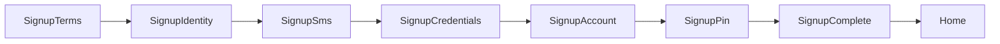

# Auth Domain

회원가입·본인인증·로그인(패스키/비밀번호)·거래 PIN·세션 도메인 요약입니다.

## 인증 계층 (섞지 않음)

| 구분 | 용도 | 저장 |
|------|------|------|
| 로그인 아이디 | Auth 식별자 | Nest `users.login_id` |
| 로그인 비밀번호 | 아이디와 함께 1차 로그인 | Nest `users.password_hash` |
| 패스키 | 보조 로그인 (P2) | `user_passkeys` (예정) |
| 휴대폰 | 본인확인·고유 연락처 | Nest profile / E.164 (서버 변환) |
| 거래 PIN | 거래·환전·계좌 변경 | Nest profile `transaction_pin_hash` |
| 닉네임 | 거래 공개 이름 | Nest profile (로그인 ID 아님) |
| 세션 | JWT access/refresh | Nest `user_sessions` + 클라 `authSession.store` |

## 시작 파일

| 작업 | Activity | Hook | API / 유틸 |
|------|----------|------|------------|
| 약관 동의 | `SignupTermsActivity` | `useSignupTermsScreen` | draft consents |
| 본인확인 | `SignupIdentityActivity` | `useSignupIdentityScreen` | draft store |
| OCTOMO | `SignupSmsActivity` | `useSignupOctomoVerify` | Edge + draft proof |
| 아이디·닉네임·비번 | `SignupCredentialsActivity` | `useSignupCredentialsFlow` | check APIs + secrets |
| 계좌 | `SignupAccountActivity` | `useSignupAccountScreen` | `accounts/verify` + token |
| 거래 PIN·최종 가입 | `SignupPinActivity` | `useSignupPinFlow` | nested `completeSignup` |
| 완료 | `SignupCompleteActivity` | (Activity 내) | 세션 유지 · 패스키 유도 |
| 로그인 | `LoginActivity` | `useLoginScreen` | loginId + password |
| 보안 설정 | `SecuritySettingsActivity` | `useSecuritySettingsScreen` | logout / passkey |
| 계정 복구 | `AccountRecoveryActivity` | `useAccountRecoveryScreen` | recovery API |

화면 순서: [docs/stackflow/README.md](../stackflow/README.md) 「화면 지도」

**API 스펙:** [docs/domains/api-spec.md](./api-spec.md) §3 Auth API  
**Fixture:** [docs/fixtures/auth/](../fixtures/auth/)  

## 코드 위치

| 역할 | 경로 |
|------|------|
| 상수·스텝 | `src/features/auth/constants.ts` |
| 가입 draft | `src/features/auth/stores/signupDraft.store.ts` |
| 가입 secrets | `src/features/auth/stores/signupSecrets.store.ts` (loginPassword·transactionPin, 메모리만) |
| 세션 | `src/features/auth/stores/authSession.store.ts` (tokens + user) |
| API facade | `src/features/auth/api/auth.api.ts`, `banks.api.ts` |
| API adapters | `src/features/auth/api/adapters/` (http / mock; supabase는 OCTOMO·레거시) |
| phone 정규화 | `src/features/auth/utils/phoneE164.ts` (표시용). **E.164 변환은 Nest** |
| Edge | `supabase/functions/octomo/` (본인인증 프록시만) |
| UI | `src/features/auth/components/` |
| Activity | `src/activities/auth/` |

## API 레이어

hook/UI는 facade만 호출합니다. Nest가 source of truth입니다.

**형제 API:** Nest.js — `VITE_API_BASE_URL=http://localhost:3000` 이면 HTTP adapter.

| 레이어 | 책임 | 예 |
|--------|------|-----|
| facade | 도메인 함수 시그니처·어댑터 선택 | `completeSignup`, `loginWithPassword` |
| adapters | HTTP / mock | `auth.http.ts`, `auth.mock.ts` |

- `VITE_API_BASE_URL`이 있으면 HTTP (Nest)
- 없으면 mock
- `httpClient`가 Bearer accessToken 자동 부착 · 에러는 `code ?? error` 파싱
- signup/login 응답: `{ user, tokens }` (`success` 없음) → `setSession`
- refresh: `POST /v1/auth/refresh`
- OCTOMO만 Supabase Edge 유지
- Swagger: `http://localhost:3000/docs`

## Phone 정규화

| 위치 | 형식 |
|------|------|
| 가입 draft / UI | `01012345678` (숫자만) |
| Nest DB | E.164 `+821012345678` (서버 변환) |

프론트는 draft를 숫자로 유지합니다.

## 가입 Activity 체인



| Activity | Route | Params | 설명 |
|----------|-------|--------|------|
| `SignupTerms` | `/auth/signup/terms` | — | 필수·선택 약관 → draft consents |
| `SignupIdentity` | `/auth/signup/identity` | — | 이름·주민번호·통신사·휴대폰 |
| `SignupSms` | `/auth/signup/sms` | `phone` | OCTOMO + draft `octomoRequestId`/`verifiedAt` |
| `SignupCredentials` | `/auth/signup/credentials` | `step?`: `loginId` \| `nickname` \| `password` | 계정 설정 (제출 없음) |
| `SignupAccount` | `/auth/signup/account` | `step?`: `bank` \| `accountNumber` | 계좌 + `accountVerifyToken` |
| `SignupPin` | `/auth/signup/pin` | `step?`: `create` \| `confirm` | PIN + **nested completeSignup** |
| `SignupComplete` | `/auth/signup/complete` | — | 완료 · 패스키 선택 유도 |
| `Login` | `/auth/login` | — | 아이디+비번 Primary · 패스키 Secondary(P2) |
| `SecuritySettings` | `/auth/security` | — | 패스키·세션·logout |
| `AccountRecovery` | `/auth/recovery` | `step?` | 복구 |

### SignupCredentials 내부

```text
loginId → nickname → password(+confirm)
```

- `loginId`: debounce `checkLoginId` → draft
- `nickname`: debounce `checkNickname` → draft
- `password`: secrets에 loginPassword → `push SignupAccount`
- 회원 생성하지 않음

### PIN flow (거래 PIN + 최종 제출)

- `create` 6자리 → secrets.transactionPin → `replace confirm`
- confirm 일치 → nested `POST /v1/auth/signup` → `setSession(tokens, user)` → `SignupComplete`
- 별도 login / `signInAfterSignup` 없음

최종 제출 시점은 **Pin confirm**입니다.

### OCTOMO 기기인증 (`SignupSms`)

상태 모델 (모바일·데스크톱 공통):

```text
READY → WAITING/CHECKING → VERIFIED → (0.8s) replace SignupCredentials(loginId)
                 ↘ DELAYED (폴링 소진) → 수동 1회 확인
                 ↘ ERROR (API 실패 안내, 폴링은 계속 가능)
```

Edge가 `exists`만 주면 프론트가 `requestId`(UUID) + `verifiedAt`(ISO)를 draft에 임시 저장합니다. Nest signup이 이를 검증합니다.

- **기본 방법**: 데스크톱 추천 → `qr`, 그 외 → `sms`. 사용자가 `문자 앱`/`QR`로 전환 가능 (PWA 설치 여부로 분기하지 않음)
- **SMS**: CTA `문자 보내기` → 방식 A (`sms:?body=`) → **복귀 후**에만 적응형 폴링 `[2s,4s,8s,15s,30s]`
- **QR**: 클라이언트 `QRCodeSVG`에 `smsHref`(`sms:번호?body=메시지`) 인코딩. OCTOMO CreateQR 미사용. 표시 후 폴링 `[10s,15s,25s,40s]`
- **exists**: `GET octomo?mobileNum=&text=&withinMinutes=` → `{ exists }`. `false`는 대기(WAITING), 오류 UI 금지
- pending: `sessionStorage` (`brit:pending-octomo`, phone/message/startedAt, 10분 만료)
- `exists: true` → VERIFIED → draft에 octomo proof → 800ms 후 `replace` SignupCredentials (`loginId`)
- DELAYED: `다시 확인하기`(1회), SMS면 `문자 앱 다시 열기`, `번호 수정하기`→`pop()`
- 폴링 유틸: `src/features/auth/utils/startOctomoPolling.ts` (hidden 시 스킵, visible 복귀 1.5s)
- API facade: `features/auth/api/octomo.api.ts` → `checkOctomoMessage` (exists)
- Edge 소스: `supabase/functions/octomo/index.ts`
- URI 유틸: `src/features/auth/utils/createOctomoSmsUrl.ts`
- 기기 힌트: `DeviceContextProvider` (UX/DEV용, OCTOMO 키·PII 없음)
- `OCTOMO_API_KEY`는 Supabase Secrets만 (프론트 `VITE_` 금지)

## Identity progressive form

내부 스텝 (`SignupIdentityStep`): `name` → `rrn` → `carrier` → `phone`

- UI: `SignupProgressiveForm` + `ActiveStepInput`
- CTA: form submit (`SIGNUP_IDENTITY_FORM_ID`)
- RRN: `SplitRrnFirst7Field` (생년월일 6 + 성별 1)
- Progress 헤더: `SignupProgressHeader`

## PIN flow (거래 PIN)

- `create` 6자리 → secrets 저장 → `replace('SignupPin', { step: 'confirm' })`
- confirm 불일치 → snackbar + 재입력
- confirm 일치 → 등록 중 UI → `completeSignup` → 세션 → `SignupComplete`
- 뒤로: confirm → `replace` create

Hook: `src/features/auth/hooks/useSignupPinFlow.ts`

## Progress bar

`SignupProgressHeader` — Activity 단위 `type` (필드별 step은 번호에 영향 없음):

| type | n / 6 | label |
|------|-------|-------|
| identity | 1 | 본인정보 |
| sms | 2 | 휴대폰 인증 |
| credentials | 3 | 계정 설정 |
| account | 4 | 계좌 연결 |
| pin | 5 | 거래 PIN |
| complete | 6 | 가입 완료 |

`SignupTerms`는 진행률 미표시. 닫기(X)만 이탈 확인 (`useSignupExitGuard`).

## 뒤로가기 vs 닫기

- 헤더 뒤로가기 → 이전 step/Activity (경고 없음)
- 오른쪽 닫기(X) → `SignupExitAlertDialog` → draft/secrets reset → Login
- Identity `carrier`·Sms QR처럼 선택/대안 UI여도 하단 CTA는 유지 (뒤로가기 후 CTA 소실 방지)
- Account `bank`(풀스크린 기관 선택)만 CTA 없음 — 이탈은 헤더 X

## 로그인

- Primary: 아이디 + 비밀번호 (`loginWithPassword`) → Nest JWT → `setSession` → `navigateToRootHome`
- Secondary: 패스키 (`PASSKEY_LOGIN_ENABLED`, 미구현 시 버튼 비활성 + `곧 사용할 수 있어요`)
- CTA: `bottomCTABehavior="keyboardAdaptive"` (키패드 위)
- 보조: `아이디·비밀번호 찾기` 시트 → `AccountRecovery` / `계정이 없으신가요? 회원가입` → `SignupTerms`
- 실패: `INVALID_CREDENTIALS` 등은 뭉뚱그린 메시지, 네트워크/5xx는 `잠시 후 다시 시도해 주세요.` (아이디 존재 여부 미노출)

## 계정 복구 (P1)

OCTOMO만으로 비밀번호를 즉시 재설정하지 않습니다. 최소 2요소:

```text
OCTOMO + (계좌 예금주 확인 | 이름·생년월일 | 기존 기기 승인 | 복구 이메일)
```

복구 후 `sensitive_actions_locked_until` 동안 계좌 변경·고액 거래·출금·거래 PIN 변경을 막습니다.

## 인증 가드

- `useRequireAuth(reason)` — 거래 등 인증 필요 액션
- `useAuthRequiredPrompt` — 탭에서 로그인 유도
- `AuthRequiredAlertDialog` — **`닫기` / `로그인`만** (가입은 Login에서)
- `assertSensitiveActionAllowed` — 복구 쿨다운 검사

가입 진입: Login → `회원가입` → `SignupTerms`

## Stack 밖 네비게이션

- 탭·가드에서 미인증: `actions.push('Login', {})` ([GlobalBottomNavigation](../../src/app/layouts/GlobalBottomNavigation.tsx))
- 가입: Login → `회원가입` → `SignupTerms`
- 가입 완료: `actions.pop` + `actions.replace('Home')` ([SignupCompleteActivity](../../src/activities/auth/SignupCompleteActivity.tsx))

## Consumer UX

- 가입 이탈: `SignupExitAlertDialog` (닫기 X에서만, 헤더 뒤로가기는 이전 화면)
- 가입 하단 CTA: Identity carrier·Sms QR에서도 1차 행동 유지 (선택 UI여도 CTA 비우지 않음)
- 카피 해요체 (`constants.ts`)
- AlertDialog 왼쪽: `닫기`
- 패스키 skip: **나중에 설정하기**

## 관련 문서

- [docs/stackflow/README.md](../stackflow/README.md)
- [CONTRIBUTING.md](../../CONTRIBUTING.md) — Consumer UX 체크리스트
