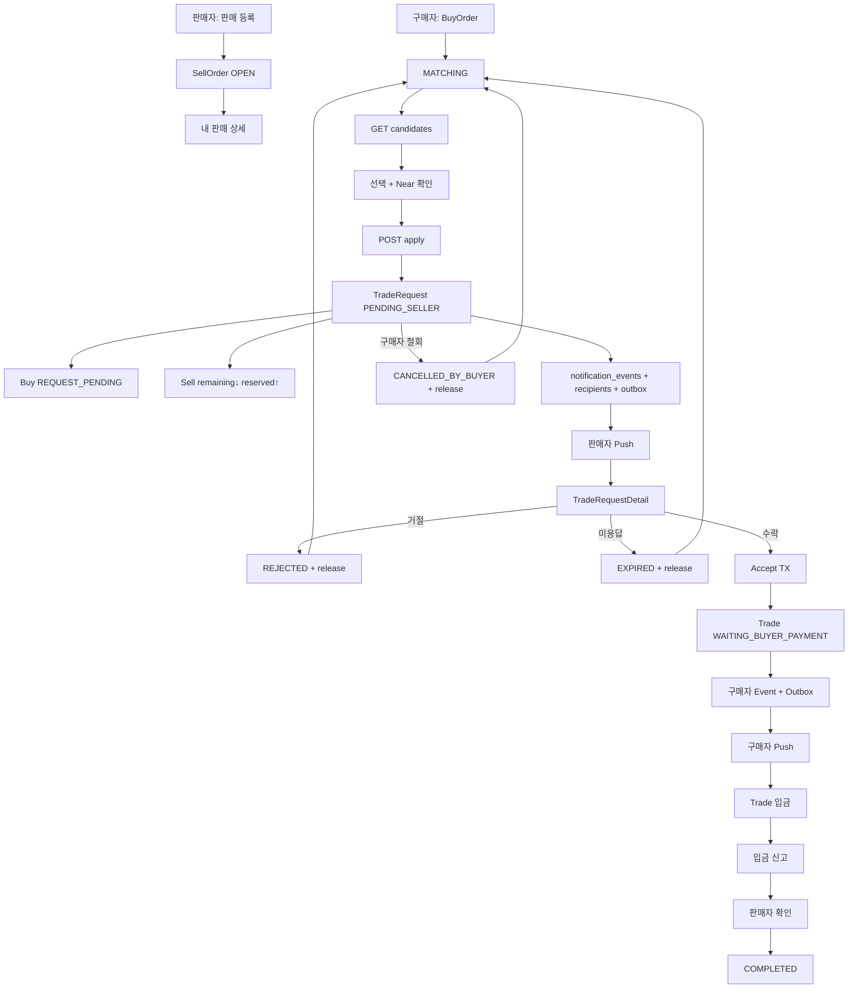

# 판매자 수락 매칭 + PWA 웹푸시 설계안 B

> **상태:** M0 정책 확정 / 미구현  
> **현재 구현:** Browse+Select에서 `POST /match` = Trade 즉시 생성  
> **변경 방향:** 구매자 Apply → 판매자 Accept → Trade 생성  
> **버전:** Draft v0.3 (2026-08-24) — M0 확정 반영  
> **관련:** [p0-5-matching.md](../../../brit-api/docs/p0/p0-5-matching.md), [p0-5b-seller-accept.md](../../../brit-api/docs/p0/p0-5b-seller-accept.md), [**M1~M4 구현 계획**](../../../brit-api/docs/p0/p0-5b-m1-m4-plan.md), [trade-scenarios](./trade-scenarios.md), [trade-payment-ux](./trade-payment-ux.md)

다음 구현 단계: **[M1~M4 계획](../../../brit-api/docs/p0/p0-5b-m1-m4-plan.md)** → 착수는 **M1 `trade_requests` Migration**.

---

## 1. 한 줄 결정

> 구매자는 거래소의 판매자를 선택해 **거래 신청(Apply)** 하고, 판매자가 **수락(Accept)** 해야만 실제 `Trade`가 생성된다.  
> 판매자가 수락하면 구매자에게 **PWA Web Push**를 발송하고, 구매자는 알림 또는 폴링을 통해 Trade 입금 화면으로 진입한다.

| 항목 | 결정 |
|------|------|
| 매칭 성립 시점 | 판매자 `accept` 성공 시 |
| 구매자 선택 API | `apply`; 기존 `match`는 deprecate |
| Trade 생성 시점 | `TradeRequest ACCEPTED` 시 |
| BuyOrder 신청 중 상태 | `REQUEST_PENDING` |
| BuyOrder당 PENDING | 1건 (partial unique) |
| SellOrder당 PENDING | 1건 (partial unique) |
| Reservation | Apply에서만 `remaining↓ reserved↑`. Accept는 **재차감 없음** |
| Buy 탐색 TTL | `MATCHING`만 적용. `REQUEST_PENDING`은 Request TTL만 |
| Buy 만료 시각 | Apply 반복해도 **연장하지 않음** (생성 시 고정) |
| Match Snapshot | Apply → `trade_requests`. Accept → Buy/Trade 복사 |
| Trade ↔ Request | `trades.trade_request_id UNIQUE`가 SoT. JOIN으로 `tradeId` 응답 |
| 판매 등록 직후 랜딩 | **내 판매 상세** (Home 아님) |
| 판매자 신규 신청 알림 | PWA Push + 인앱 (`notification_events`) |
| 구매자 수락 알림 | PWA Push + `/trade?tradeId=` (P0) |
| Push 실패 | 업무 상태 불변. Outbox 재시도 + 폴링 복구 |
| Push 발송 | Notification Event + Recipient + **Transactional Outbox** |
| Matching 실시간 | Socket/SSE **미사용** (Polling + Push) |
| 입금 제한시간 | **Accept(=Trade 생성) 시각부터** |
| Apply 멱등 | `Idempotency-Key` |
| Accept 멱등 | 이미 ACCEPTED면 기존 `tradeId` 200 |
| Near 후보 | 기존 정책 유지, Apply 시 서버 재검증 |
| 신청 TTL | 기본 180초 (`matching_policies.trade_request_timeout_seconds`) |
| REQUEST_PENDING 중 candidates | **불가** (`BUY_ORDER_REQUEST_PENDING`) |
| 로켓 문의 | Request/Trade CTA (Workbench는 P0-7) |
| 신뢰점수/우수판매자 | 이번 범위 제외 |

### M0 핵심 원칙 3가지

1. Candidate 선택만으로 거래가 성립하지 않는다. **판매자 수락이 Binding**.
2. Buy·Sell 각각 **PENDING_SELLER 1건**만 허용해 UX·동시성을 단순화한다.
3. Push는 SoT가 아니다. DB 확정 상태를 빠르게 전달하는 보조 채널이며, 실패해도 Polling으로 복구한다.

---

## 2. 변경 목적

```text
[현재] Candidate 선택 → POST /match → Trade 즉시 → 판매자는 입금 확인부터 개입

[변경] Candidate 선택 → POST /apply → TradeRequest PENDING_SELLER
      → 판매자 Accept → Trade → 구매자 입금
```

Candidate 조회, Exact/Near, Near 금액 변경 정책은 **유지**.  
바뀌는 것은 **선택 이후 Transaction Boundary**와 Buy 상태(`REQUEST_PENDING`).

---

## 3. 도메인 정의

### 3.1 엔티티 책임

| 엔티티 | 역할 |
|--------|------|
| `buy_orders` | 구매 탐색·매칭 세션 (`MATCHING` / `REQUEST_PENDING` / …) |
| `sell_orders` | 판매 물량. Apply 시 Reservation |
| `trade_requests` | 특정 Sell에 대한 **신청 업무 객체** (Candidate 저장 아님) |
| `matching_attempts` | Candidate 탐색·알고리즘 이력만 (수락/거절 이력 넣지 않음) |
| `trades` | Accept 이후 실거래. `trade_request_id UNIQUE NOT NULL` |
| `trade_coin_lots` | Trade 귀속 Lot |
| `notification_events` | 업무 사건 (기존). **신규 `notifications` 테이블 만들지 않음** |
| `notification_recipients` | 수신자·읽음 (기존) |
| `user_push_subscriptions` | PWA/브라우저 Push 구독 (**신규**) |
| `notification_outbox` | Push 전달 Outbox (**신규**) |

```text
Candidate = 조회 Projection
TradeRequest = 사용자가 특정 판매자에게 신청한 업무 객체
```

### 3.2 Match 정보 소유 시점

```text
Candidate          = 계산 결과 (저장하지 않음)
TradeRequest       = Apply 당시 Snapshot (requested_coin_amount, match_type)
BuyOrder           = Accept 이후 최종 (matched_coin_amount, match_type)
Trade              = 확정 거래 Snapshot (coin_amount = Request snapshot)
```

---

## 4. TradeRequest 상태

```text
PENDING_SELLER
  ├ ACCEPTED           → Trade 생성, Buy MATCHED
  ├ REJECTED           → Reservation 해제, Buy MATCHING
  ├ EXPIRED            → 동일
  └ CANCELLED_BY_BUYER → 동일
```

종료 상태는 `PENDING_SELLER`로 되돌리지 않는다.  
`ACCEPTED` 이후 reject/cancel 불가. 이후 업무는 Trade에서만.

---

## 5. BuyOrder 상태

```text
MATCHING | REQUEST_PENDING | MATCHED | COMPLETED | CANCELLED | EXPIRED
```

| 전이 | 조건 |
|------|------|
| `MATCHING` → `REQUEST_PENDING` | Apply 성공 |
| `REQUEST_PENDING` → `MATCHING` | Reject / Expire / Buyer Cancel |
| `REQUEST_PENDING` → `MATCHED` | Accept |
| `MATCHING` → `EXPIRED` | Buy TTL (아래 §7) |

의미:

- `MATCHING` = 판매자 탐색 중 (`GET candidates` 가능)
- `REQUEST_PENDING` = 특정 판매자 응답 대기 (`GET candidates` **불가**)

---

## 6. Reservation 규칙 (확정)

```text
Apply
→ remaining ↓
→ reserved ↑
→ TradeRequest PENDING_SELLER
→ Trade 없음

Accept
→ remaining / reserved 변경 없음  ※ 재차감 금지
→ 기존 reserved를 Trade에 Binding
→ TradeCoinLot allocation
→ Trade 생성

Reject / Expire / Buyer Cancel
→ reserved ↓
→ remaining ↑

Trade COMPLETED (기존 P0-6)
→ reserved ↓
→ completed ↑
```

예:

```text
Sell remaining=500000, reserved=0
→ Apply 500000 → remaining=0, reserved=500000, Request PENDING
→ Accept → remaining=0, reserved=500000, Trade=500000
→ Complete → reserved=0, completed=500000
```

공통 해제: `TradeRequestReservationService.release()` (Idempotent).  
Apply / Accept / Reject / Cancel / Expire에서 흩뿌리지 않는다.

---

## 7. TTL 분리 (확정)

| TTL | 적용 상태 | 기본 |
|-----|-----------|------|
| Buy 탐색 | **`MATCHING`만** | 900초 (`BUY_MATCHING_TIMEOUT_SECONDS`) |
| TradeRequest | **`PENDING_SELLER`만** | 180초 (`trade_request_timeout_seconds`) |

```text
REQUEST_PENDING
→ Buy TTL Worker 대상 제외
→ TradeRequest TTL만 적용
```

Buy 만료 시각은 **생성 시 고정**. Request를 반복해도 연장하지 않음.

```text
Buy 생성 10:00 → expires 10:15
Apply 10:05 → Request 만료 10:08
다시 MATCHING → Buy 만료는 여전히 10:15
```

입금 제한:

```text
buyer_payment_due_at = trade.created_at + buyer_payment_timeout
(= Accept 시각부터. Apply부터 줄어들지 않음)
```

---

## 8. PENDING 1건 + DB 제약

```text
BuyOrder당 PENDING TradeRequest 최대 1건
SellOrder당 PENDING TradeRequest 최대 1건
```

```sql
CREATE UNIQUE INDEX uq_trade_request_pending_buy
ON trade_requests (buy_order_id)
WHERE status = 'PENDING_SELLER';

CREATE UNIQUE INDEX uq_trade_request_pending_sell
ON trade_requests (sell_order_id)
WHERE status = 'PENDING_SELLER';
```

다른 구매자가 같은 Sell에 Apply → `409 SELL_ORDER_PENDING_REQUEST`.

---

## 9. TradeRequest 스키마 (최소)

```text
trade_requests
  id
  buy_order_id
  sell_order_id
  buyer_user_id
  seller_user_id
  requested_coin_amount   -- Apply snapshot
  match_type              -- EXACT | NEAR
  status
  expires_at
  rejection_reason_code   -- nullable (P0: code만, 자유문구 구매자 미노출)
  accepted_at / rejected_at / cancelled_at / expired_at
  idempotency_key         -- nullable, buyer 단위 unique 권장
  created_at / updated_at
```

```text
trades
  trade_request_id UNIQUE NOT NULL   -- 관계 SoT
```

`trade_requests.trade_id` **중복 FK는 두지 않음**.  
`GET /trade-requests/:id`는 `LEFT JOIN trades ON trades.trade_request_id = …`로 `tradeId` 응답.

---

## 10. matching_attempts

수락/거절/만료/철회를 **넣지 않음**.  
탐색·Exact/Near·Candidate 변경 감지 등 알고리즘 이력만.

MVP에서 `trade_request_events` 없음. Timeline 필요 시 후속.

---

## 11. End-to-End



---

## 12. Apply API

```http
POST /v1/buy-orders/:buyOrderId/apply
Idempotency-Key: required
```

```json
{
  "sellOrderId": "SELL-UUID",
  "expectedMatchType": "EXACT",
  "expectedCoinAmount": "500000"
}
```

```json
{
  "tradeRequestId": "REQ-UUID",
  "status": "PENDING_SELLER",
  "expiresAt": "2026-08-24T10:28:00+09:00",
  "match": { "type": "EXACT", "coinAmount": "500000" }
}
```

같은 Idempotency-Key → **기존 REQ 반환** (409 대신).

### Apply TX

```text
BEGIN
  BuyOrder FOR UPDATE
  - buyer 일치, status = MATCHING, Buy TTL 미만료
  - 기존 PENDING Request 없음

  SellOrder FOR UPDATE
  - 신청 가능, 자기 주문 아님, PENDING 없음
  - Candidate 서버 재계산 vs expected
  - 불일치 → CANDIDATE_CHANGED

  TradeRequest PENDING_SELLER + snapshot + expires_at
  Sell remaining↓ reserved↑
  Buy MATCHING → REQUEST_PENDING
  notification_events + recipients + outbox (판매자 신규 신청)
COMMIT
→ Outbox Worker가 Push
```

---

## 13. Accept API

```http
POST /v1/trade-requests/:tradeRequestId/accept
```

```json
{
  "tradeRequestId": "REQ-UUID",
  "tradeId": "TRADE-UUID",
  "tradeStatus": "WAITING_BUYER_PAYMENT",
  "match": { "type": "EXACT", "coinAmount": "500000" }
}
```

이미 `ACCEPTED` → 기존 `tradeId` **200 멱등**.

### Accept TX

```text
BEGIN
  TradeRequest FOR UPDATE
  - PENDING_SELLER, seller 일치, NOW < expires_at

  BuyOrder FOR UPDATE — REQUEST_PENDING
  SellOrder FOR UPDATE — Reservation 유효
  - 훼손 → REQUEST_STALE

  ※ remaining/reserved 재차감 금지

  Trade 생성 (WAITING_BUYER_PAYMENT)
  - coin_amount = Request snapshot
  - buyer_payment_due_at = now + policy
  - trade_request_id = Request.id
  TradeCoinLot allocation

  Buy matched_coin_amount / match_type = snapshot 복사
  Buy REQUEST_PENDING → MATCHED
  TradeRequest → ACCEPTED

  notification_events + recipients + outbox (구매자 수락)
COMMIT
```

Push는 TX 밖(Outbox Worker).

---

## 14. Accept vs Expire Race

둘 다 `TradeRequest FOR UPDATE`.

- Accept 선승 → Worker는 PENDING 아님 → no-op  
- Expire 선승 → Accept는 `409 TRADE_REQUEST_EXPIRED`  
동시 성공 상태 없음.

---

## 15. Reject / Cancel / Expire

### Reject

```http
POST /v1/trade-requests/:id/reject
{ "reasonCode": "NOT_AVAILABLE_NOW" }
```

P0: `rejection_reason_code`만. 구매자 카피 고정:  
「판매자가 이번 거래를 진행하기 어렵다고 했어요.」  
자유문구 Detail은 운영 전용(후속).

### Cancel (구매자)

`PENDING_SELLER`만. → `CANCELLED_BY_BUYER` + release.

### Expire Worker

`PENDING_SELLER AND expires_at <= NOW()` → `EXPIRED` + release + Buy `MATCHING`.

---

## 16. API 목록

| Method | Path | 주체 | 목적 |
|--------|------|------|------|
| POST | `/buy-orders/:id/apply` | 구매자 | 신청 (`Idempotency-Key`) |
| POST | `/trade-requests/:id/accept` | 판매자 | 수락 + Trade |
| POST | `/trade-requests/:id/reject` | 판매자 | 거절 |
| POST | `/trade-requests/:id/cancel` | 구매자 | 철회 |
| GET | `/trade-requests/:id` | 당사자 | 폴링 (`tradeId` JOIN) |
| GET | `/sell-orders/:id/pending-request` | 판매자 | 대기 1건 + `buyer` 요약 (P0) |
| GET | `/buy-orders/:id/candidates` | 구매자 | `MATCHING`만 |
| GET | `/buy-orders/:id/matching-status` | 구매자 | 복구 (아래) |

`POST .../match` → deprecate.

### matching-status 확장 예

```json
{
  "buyOrderId": "BUY-001",
  "status": "REQUEST_PENDING",
  "tradeRequest": {
    "id": "REQ-001",
    "status": "PENDING_SELLER",
    "expiresAt": "..."
  },
  "tradeId": null
}
```

### REQUEST_PENDING 중 candidates

```http
409 BUY_ORDER_REQUEST_PENDING
"현재 판매자의 응답을 기다리고 있어요."
```

---

## 17. 오류 코드

| Code | HTTP | 의미 |
|------|-----:|------|
| `TRADE_REQUEST_NOT_FOUND` | 404 | |
| `TRADE_REQUEST_NOT_PENDING` | 409 | 이미 처리됨 (멱등 Accept 제외) |
| `TRADE_REQUEST_EXPIRED` | 409 | TTL |
| `SELL_ORDER_PENDING_REQUEST` | 409 | Sell에 다른 PENDING |
| `BUY_ORDER_PENDING_REQUEST` | 409 | Buy에 이미 PENDING (Idempotency 없을 때) |
| `BUY_ORDER_REQUEST_PENDING` | 409 | candidates 등 탐색 API 차단 |
| `CANDIDATE_CHANGED` | 409 | **Apply** 시 expected 불일치 |
| `REQUEST_STALE` | 409 | **Accept** 시 Reservation 전제 훼손 (운영 개입·정합성). 정상 Soft-lock에선 거의 없음 |
| `TRADE_REQUEST_ACCESS_DENIED` | 403 | 당사자 아님 |
| `SELF_TRADE_NOT_ALLOWED` | 409 | 자기 Sell |
| `SELL_ORDER_UNAVAILABLE` | 409 | 신청 불가 |

---

## 18. 판매자 UX

### 전제: 1인 1활성 판매 흐름

Brit은 사용자당 **동시에 하나의 판매/거래 흐름**만 진행한다.  
여러 Sell → Pending Queue는 쓰지 않는다.

```text
판매 등록 → 구매자 대기 → 구매 요청 → 수락/거절 → 거래 → 완료
```

`FULLY_RESERVED`는 서버 Soft-lock 상태이며 **그대로 유지**한다.  
Sheet open 기준은 Sell status가 아니라 **`PENDING_SELLER`(pending-request 존재)** 이다.

### GlobalSheetHost + PurchaseRequestSheet (강제 Attention)

App Root의 `GlobalSheetHost`가 강제 BottomSheet 레이어다. (거래 도메인 특수 구조가 아님)

```text
TRADE_REQUEST_CREATED / 폴링 / 앱 진입 bootstrap
  → useCurrentSellFlow (active sell[0] + pending-request)
  → uiState === PURCHASE_REQUEST
  → PurchaseRequestSheet 강제 노출
       ├─ 판매하기 → Accept → Trade 입금 대기
       └─ 이번 요청 거절 → 시트 내 사유 → Reject → 현재 화면 유지
```

정책:

- X / Drag Handle / swipe dismiss / outside / Escape **불가** — 판매 또는 거절만 닫힘
- 활성 Sell 1건만 조회 (`listMyActiveSellOrders`에 OPEN|PARTIAL|FULLY_RESERVED 포함 — pending을 놓치지 않기 위함)
- `GET .../pending-request`·`GET /trade-requests/:id` 응답에 `buyer` 요약 포함

```json
"buyer": {
  "nicknameMasked": "테**",
  "completedTradeCount": 128,
  "completionRate": 98
}
```

`completionRate`: 백엔드 SoT. `settled = COMPLETED + CANCELLED`, `settled === 0 → 100`, else `floor(completed/settled*100)`.

decide 카피 요지: 「{Coin}을 판매할까요?」 / UserSummary / 판매 금액 / 30분 입금 안내 / **판매하기** · **이번 요청 거절**.

거절 사유 (인시트): 지금 거래하기 어려워요 / 다른 요청을 기다릴게요 / 기타.

### 홈 진행 카드 (지속 Entry Point)

강제 Sheet와 **대체 관계가 아니다**.

| uiState | 홈 카드 | 금액 source | 탭 |
|---------|---------|-------------|-----|
| WAITING_BUYER | 판매 · 구매자 대기 | Sell remaining (없으면 original) | SellOrderDetail |
| PURCHASE_REQUEST | 구매 요청이 도착했어요 | **pending.match.coinAmount** | **Sheet 재오픈** |
| TRADE_IN_PROGRESS | Trade 카드 (Sell 카드 생략) | Trade amount | Trade |

홈 「진행 중」은 actionable Trade만 (`PAYMENT_PENDING` / `PAYMENT_REPORTED` / `COIN_TRANSFERRING` / `MATCHING`).  
`DISPUTED` → 「분쟁 진행 중」 attention (신규 Compose **허용**).  
`PAYMENT_TIMEOUT` → 「미입금 확정」 attention (판매자면 Compose 차단).  
`FULLY_RESERVED`는 **pending이 있을 때만** Sheet/대기 카드 — pending 없는 좀비 reserved는 홈 Sell에서 제외.

공유: `useCurrentSellFlow` / `sellFlow.store` — Home과 GlobalSheetHost가 동일 snapshot을 본다.

### SellOrderDetail (등록 직후 · 내 판매 운영 허브)

```text
POST /sell-orders
→ replace('SellOrderDetail', { sellOrderId, entryContext: 'created' })
```

역할: 거래 상세가 아니라 **판매 등록 이후 운영 허브**. 수락/거절 CTA는 두지 않고 `GlobalSheetHost`에 맡긴다.

정보 구조 (위→아래):

1. **Hero** — `entryContext=created`면 체크 + 「{금액} Coin 판매를 등록했어요」 / 재진입은 「{금액} Coin 판매」 + 상태 문장·칩
2. **판매 현황** — 판매 대기 / 거래 중 / 판매 완료 (`remaining` / `reserved` / `completed`)
3. **구매 요청** — empty 또는 pending 1건 카드(카운트다운) — 결정 UI는 전역 시트
4. **판매 정보 >** — 주문번호·등록 일시·판매 금액 (BottomSheet)
5. **하단** — `WAITING_BUYER`(pending 없음)일 때만 `판매 등록 취소` Bottom CTA (`neutralOutline`, 찾기 중단과 동일). pending이면 GlobalSheetHost가 결정 UI이므로 숨김. 구매 요청 카드 탭 → Sheet 재오픈.

상태 문장 예: OPEN+요청없음 → 「구매자 기다리는 중」, pending → 「구매 요청이 도착했어요」.

취소: BottomSheet 확인 후 `POST /sell-orders/:id/cancel` (remaining만 unlock). 홈으로 CTA는 두지 않음 (X로 Home).

---

## 19. 구매자 UX

```text
MatchingWaiting (Feed) → Apply → TradeRequestWaiting
```

### MatchingWaiting (한 화면 · SellOrder 리스트 중심)

- **데이터**: `GET /v1/buy-orders/:id/candidates` 폴링 (Market browse와 분리). Exact / Near는 같은 후보의 필터·정렬.
- **Adaptive Hero (건수 기반)**: 0건 → large APNG / 1~2건 → discovery (large APNG + 리스트) / 3~4건 → compact 가로 status banner (small APNG) / 5건+ → listFocused (APNG 없음, `● 실시간 업데이트`). Exact 자동 수락 시트는 listFocused(5건+) 진입 후에만.
- **Empty**: 고정 Summary 아래 보조 카피 + large Hero. 「다시 찾기」 CTA 없음.
- **결과**: Exact→Near 단일 정렬 리스트 (`sortMatchingCandidates`) + `SellOrderRow`. Exact/Near **탭 분리 없음**. 후보 리스트만 스크롤, Summary·조건·Header·CTA 고정.
- **신규 후보**: listFocused 전에는 Row 「새 제안」 badge (수 초 후 페이드). listFocused에서는 insert 애니만. 스크롤 중이면 floating pill 유지.
- **첫 Exact** (Near 탭 중): 탭 강제 전환 금지. 「정확한 금액의 판매자를 찾았어요 · [정확 매칭 보기]」 인라인 배너만.
- **하단**: `구매 {금액} · 수수료 없음` + 조건 변경 / 찾기 중단.
- **Apply 충돌** (이미 체결 등): 스낵바 「이 판매 건은 방금 다른 거래로 연결됐어요」 + 해당 row 제거(`skipCandidate`) + MATCHING 폴링·검색 계속.

대기(Apply 후): 금액, 남은 응답 시간, PushEnableCard(「수락하면 바로 알려드릴까요?」), 신청 취소.  
거절/만료 → 스낵바 → Buy `MATCHING` → Feed 복귀.

진입 직후 Browser Permission 강제 금지 (consumer-ux).

---

## 20. 알림·Push (기존 모델 확장)

```text
notification_events     = 사건
notification_recipients = 수신·읽음
user_push_subscriptions = 기기 구독 (신규)
notification_outbox     = Push 작업 (신규)
```

**신규 `notifications` 테이블 금지.**

Accept 예:

```text
event_type = TRADE_REQUEST_ACCEPTED
reference_type = TRADE
reference_id = TRADE-001
→ recipient = buyer
→ outbox PENDING
```

### Outbox

```text
BEGIN 업무 변경 + event + recipient + outbox INSERT
COMMIT
→ Outbox Worker → Web Push (실패 시 attempt++, next_attempt_at)
```

Trade 성공 ≠ Push 성공.

### Push 이벤트

| 이벤트 | 수신 | 메시지 | 식별자 |
|--------|------|--------|--------|
| 새 신청 | 판매자 | 구매 신청이 왔어요 | `TRADE_REQUEST` |
| 수락 | 구매자 | 거래가 성사됐어요. 입금해 주세요 | `TRADE` |
| 거절 | 구매자 | 다른 판매자를 확인해 주세요 | `BUY_ORDER` / Matching |
| 만료 | 구매자 | 응답 시간이 지났어요 | Matching |
| 입금 신고 | 판매자 | 입금 확인이 필요해요 | `TRADE` |

### 딥링크 (P0)

Stackflow 유지: `/trade?tradeId=…`.  
Push payload는 URL 하드코딩보다 `{ referenceType, referenceId }` → Front가 route 생성.  
클릭 시 **서버 최신 GET**으로 화면 (payload 상태 신뢰 금지).

### 폴링 복구 (필수)

대기 화면 `GET /trade-requests/:id` 2~3초:

- `PENDING_SELLER` → 대기  
- `ACCEPTED` + `tradeId` → Trade  
- `REJECTED` / `EXPIRED` → Matching  

---

## 21. Socket

Matching / TradeRequest: **Polling + Push만**.  
분쟁 채팅 Socket은 **P0-7 별도**.

---

## 22. 로켓 문의

Request·Trade CTA → 사유 + 메시지 + 참조 ID + 운영 알림.  
Trade 이후 분쟁은 `trade_disputes` (P0-7).

---

## 23. 운영 지표 (후속)

Request 수, Accept/Reject/Expire/Cancel Rate, Avg·p50·p95 Accept Time, Accept→Payment Rate, Completion Rate.  
TTL 180초는 지표 보고 조정.

품질 점수·가중 Matching은 **비범위**.

---

## 24. 마일스톤

| ID | 내용 | 의존 |
|----|------|------|
| **M0** | 본 정책 확정 | — **완료(본 문서 v0.3)** |
| M1 | `trade_requests` + Buy `REQUEST_PENDING` Migration | M0 — 상세: [p0-5b-m1-m4-plan](../../../brit-api/docs/p0/p0-5b-m1-m4-plan.md) |
| M2 | Apply TX + Idempotency + Reservation | M1 |
| M3 | Accept / Reject / Cancel TX | M2 |
| M4 | Expire Worker + release 공통 서비스 | M3 |
| M5 | 판매자 UX (Detail + Request) | M2~M4 |
| M6 | 구매자 대기 UX + candidates 차단 | M2~M4 |
| M7 | Push subscription + Outbox + SW | M3 |
| M8 | 로켓 문의 MVP | M5~M6 |
| M9 | E2E·Race 테스트 | 전체 |
| M10 | `/match` deprecate, p0-4/5 문서 격상 | M9 |

---

## 25. 필수 테스트

1. 정상 Accept → Trade 1 + 구매자 Outbox  
2. Reject / Expire / Cancel → release + Buy MATCHING  
3. Buy·Sell 동시 Apply 폭주 → PENDING 각 1건  
4. Accept vs Expire → ACCEPTED+Trade **또는** EXPIRED, 둘 중 하나  
5. Cancel vs Accept → 하나만 성공  
6. Accept 멱등 20회 → Trade 1  
7. Apply Idempotency-Key 더블탭 → 동일 REQ  
8. REQUEST_PENDING 중 candidates → 409  
9. Push 실패 → Trade 유지, 폴링 진입  
10. Push 늦게 클릭 → GET Trade 최신 상태  
11. Buy TTL은 MATCHING만; REQUEST_PENDING 중 Buy EXPIRED 없음  
12. 판매 등록 → SellOrderDetail (Home 아님)  
13. Accept 시 remaining/reserved 재차감 없음  

---

## 26. 체크리스트

- [ ] `p0-4-orders.md` — 판매 등록 → 상세 (코드도 Home→Detail)  
- [ ] `p0-5-matching.md` — match 즉시 Trade 제거, apply/accept  
- [ ] `p0-5b-seller-accept.md` — 본 M0와 동기화  
- [ ] `trade-scenarios.md` — Binding = Accept  
- [ ] `trade-payment-ux.md` — 입금 TTL = Accept부터  
- [ ] `buy_order_status` + `REQUEST_PENDING`  
- [ ] `trade_requests` + pending unique indexes  
- [ ] Apply / Accept / Reject / Cancel / Expire  
- [ ] Reservation release 서비스  
- [ ] `/match` deprecate  
- [ ] Front Waiting / RequestDetail / SellOrderDetail  
- [ ] `user_push_subscriptions` + `notification_outbox`  
- [ ] event types 확장 (기존 notification_events)  
- [ ] SW Push + polling fallback  
- [ ] E2E + race  

---

## 27. 비범위

```text
Buy/Sell 다중 동시 PENDING
숨은 Auto Match
신뢰 점수 / Rating / Badge / 가중 Matching
Matching Socket/SSE
분쟁 채팅 Socket (P0-7)
notifications 신규 테이블
trade_requests.trade_id 양방향 FK
/trades/:id canonical (P0는 /trade?tradeId= 유지)
```

---

## 28. 최종 상태 요약

**판매자:** Sell OPEN → Request PENDING → Accept → Trade 입금대기 → 확인 → COMPLETED  

**구매자:** Buy MATCHING → Apply → REQUEST_PENDING → (Reject/Expire/Cancel → MATCHING) | (Accept → MATCHED → 입금)

```text
Apply = 물량 선점
Accept = 선점 물량 Trade Binding + 입금 TTL 시작
Complete = 판매 완료
```
